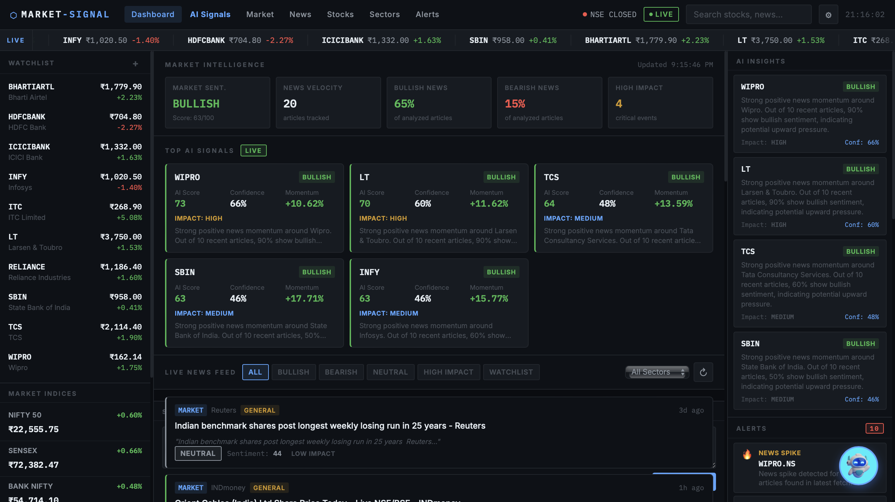
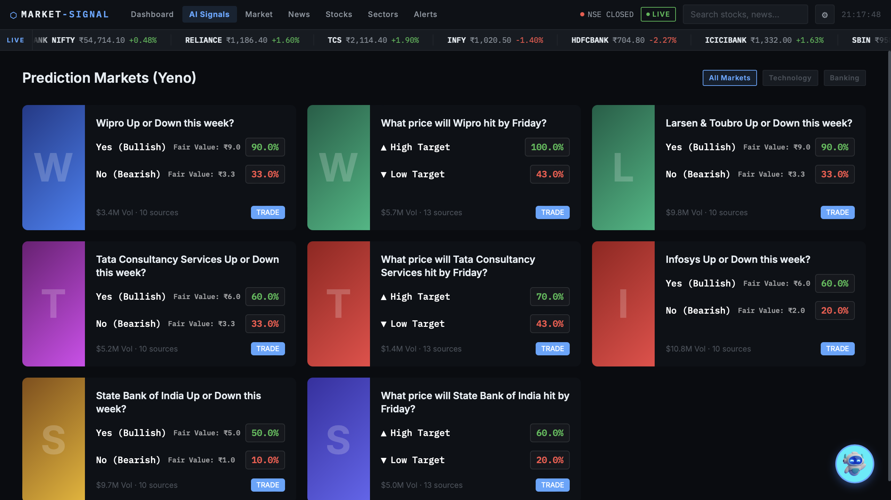
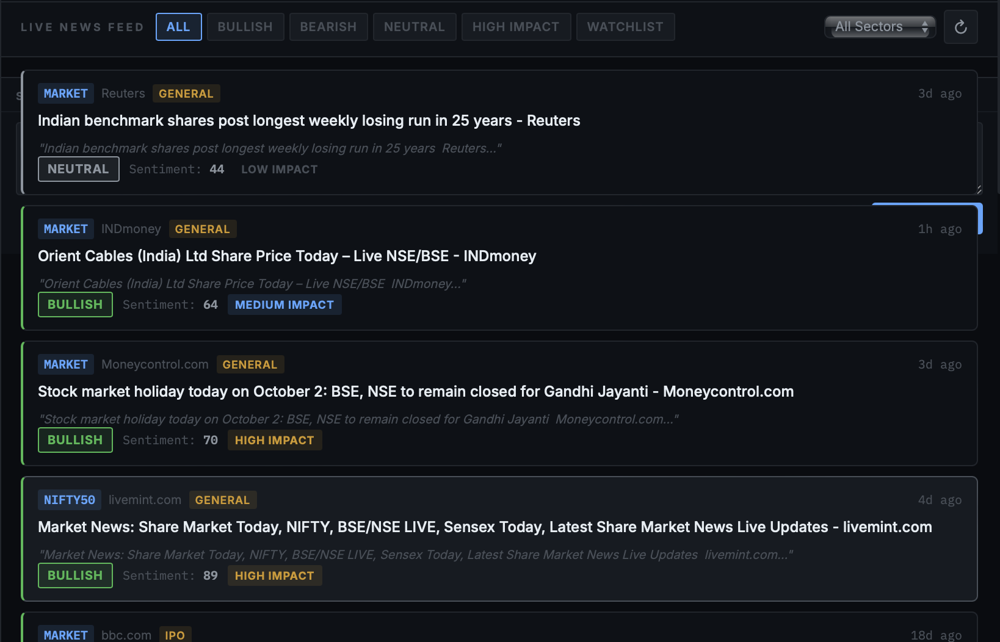
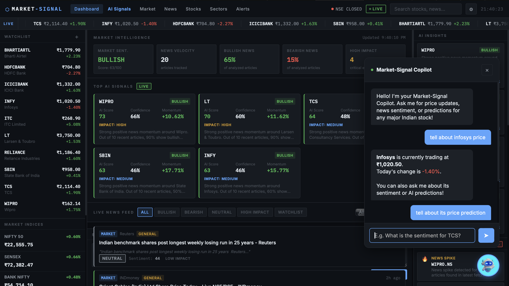
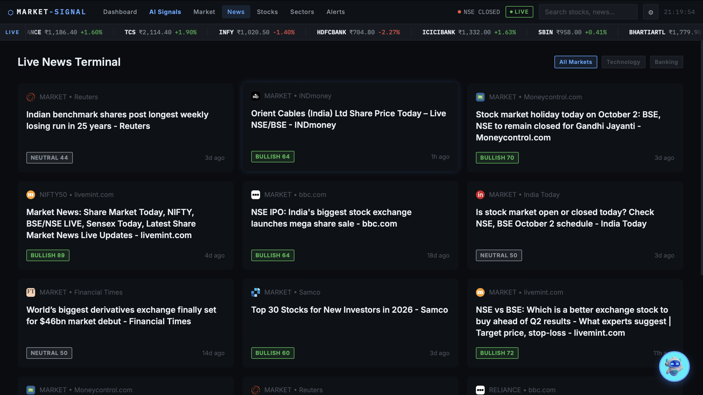

# 📈 Market-Signal



> **An AI-driven market intelligence terminal built for prediction market trading.**

---

## 🚀 Overview
**Market-Signal** is a full-stack financial dashboard designed to bridge the gap between global news sentiment and actionable trading decisions. It ingests live financial news and real-time stock data, runs it through an AI sentiment engine, and translates that data directly into **Prediction Market probabilities and Fair Value contract prices**.



---

## ✨ Core Features

### 1. Live Market Data & Dynamic Watchlist

The backend seamlessly connects to Yahoo Finance (`yfinance`) for real-time ticker pricing (NIFTY 50, TCS, Reliance, etc.). The UI features a Bloomberg-style continuous ticker tape and a dynamic live watchlist that updates mathematically correct day-over-day changes.

### 2. AI News Sentiment Engine
Market-Signal scrapes live Google News RSS feeds for targeted stocks and passes headlines through a **VADER Natural Language Processing (NLP)** pipeline. It translates text sentiment (Bullish/Bearish) into a 0-100 score, enabling Explainable AI (XAI) that highlights exactly *why* a market is moving.

### 3. Prediction Market Engine (Yeno Fair Value)
Built with prediction platforms in mind, Market-Signal translates the AI sentiment score into a probability percentage (e.g., "64% chance of upward momentum"). It then automatically outputs a calculated **Fair Value Price** (e.g., ₹6.4 for a YES contract) and allows users to simulate buying these contracts.

### 4. Autonomous NLP Copilot

A custom-built, regex-driven NLP chatbot acts as your trading copilot. It understands user intent (Price vs. Sentiment vs. Predictions), handles anti-hallucination guardrails seamlessly, and **dynamically auto-fetches missing backend data** in real-time if a queried stock isn't currently cached.

### 5. System Alerts & UI Polish

Automated System Alerts detect sudden spikes in news volume and flag high-impact events. The frontend is a sleek, zero-dependency Vanilla JS/CSS masterpiece featuring a responsive masonry news grid, animated loaders, and a highly polished dark-mode aesthetic.

---

## 💻 Tech Stack
- **Backend:** Python, Flask, VADER Sentiment Analysis, BeautifulSoup, `yfinance`.
- **Frontend:** Vanilla JavaScript, CSS3 (CSS Variables), HTML5.
- **Architecture:** RESTful API with intelligent server-side caching to prevent API rate-limits and guarantee lightning-fast frontend loads.

---

## ⚙️ Installation & Usage

1. **Install dependencies:**
   ```bash
   pip install -r requirements_new.txt
   ```

2. **Run the local Flask server:**
   ```bash
   python3 app.py
   ```

3. **Access the Terminal:**
   Navigate to `http://127.0.0.1:5001` in your browser.
